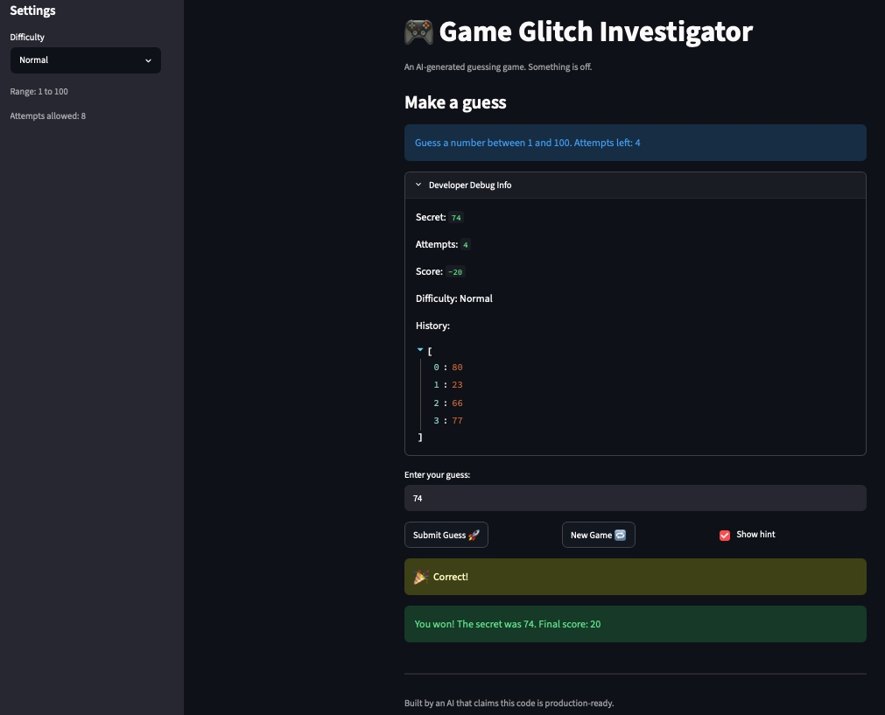

# 🎮 Game Glitch Investigator: The Impossible Guesser

## 🚨 The Situation

You asked an AI to build a simple "Number Guessing Game" using Streamlit.
It wrote the code, ran away, and now the game is unplayable.

- You can't win.
- The hints lie to you.
- The secret number seems to have commitment issues.

## 🛠️ Setup

1. Install dependencies: `pip install -r requirements.txt`
2. Run the broken app: `python -m streamlit run app.py`

## 🕵️‍♂️ Your Mission

1. **Play the game.** Open the "Developer Debug Info" tab in the app to see the secret number. Try to win.
2. **Find the State Bug.** Why does the secret number change every time you click "Submit"? Ask ChatGPT: _"How do I keep a variable from resetting in Streamlit when I click a button?"_
3. **Fix the Logic.** The hints ("Higher/Lower") are wrong. Fix them.
4. **Refactor & Test.** - Move the logic into `logic_utils.py`.
   - Run `pytest` in your terminal.
   - Keep fixing until all tests pass!

## 📝 Document Your Experience

- [ ] Describe the game's purpose.
- [ ] Detail which bugs you found.
- [ ] Explain what fixes you applied.

## 📸 Demo Walkthrough

Describe your fixed game in numbered steps so a reader can follow along without watching a video:

1. Reading the hint of the guessing boundary and attempts left, I enter a guess of 24 and click the Submit Guess button.
2. Hint states to go higher.
3. I enter 44 and the hint states to go higher, with 7 attempts left.
4. I enter 100, hint states to go lower, with 6 attempts left.
5. Clicking on Developer Debug Info, I see secret is 98, so I enter 98, I get a correct banner with balloons and a message of "You won! The secret was 98. Final score: 35" which ends the game. The attempts were correctly tracked with the guess saved.

**Screenshot** _(optional)_: <!-- Insert a screenshot of your fixed, winning game here -->

## 🧪 Test Results

```
# Paste your pytest output here, e.g.:
cd /gameglitchinvestigator && python -m pytest tests/test_game_logic.py -v 2>&1
=================================================================== test session starts =======================================================================
platform darwin -- Python 3.13.13, pytest-9.0.3, pluggy-1.6.0 -- /.venv/bin/python
cachedir: .pytest_cache
rootdir: /gameglitchinvestigator
plugins: anyio-4.13.0
collected 6 items

tests/test_game_logic.py::test_exact_match_returns_win PASSED                                                                                            [ 16%]
tests/test_game_logic.py::test_guess_too_high_returns_correct_outcome_and_hint PASSED                                                                    [ 33%]
tests/test_game_logic.py::test_guess_too_low_returns_correct_outcome_and_hint PASSED                                                                     [ 50%]
tests/test_game_logic.py::test_negative_input_is_rejected PASSED                                                                                         [ 66%]
tests/test_game_logic.py::test_out_of_range_input_is_rejected PASSED                                                                                     [ 83%]
tests/test_game_logic.py::test_decimal_input_is_truncated_to_int PASSED                                                                                  [100%]

============================================================= 6 passed in 0.02s ======================================================================
```

## 🚀 Stretch Features

- [ ] [If you choose to complete Challenge 4, describe the Enhanced UI changes here — a screenshot is optional]
